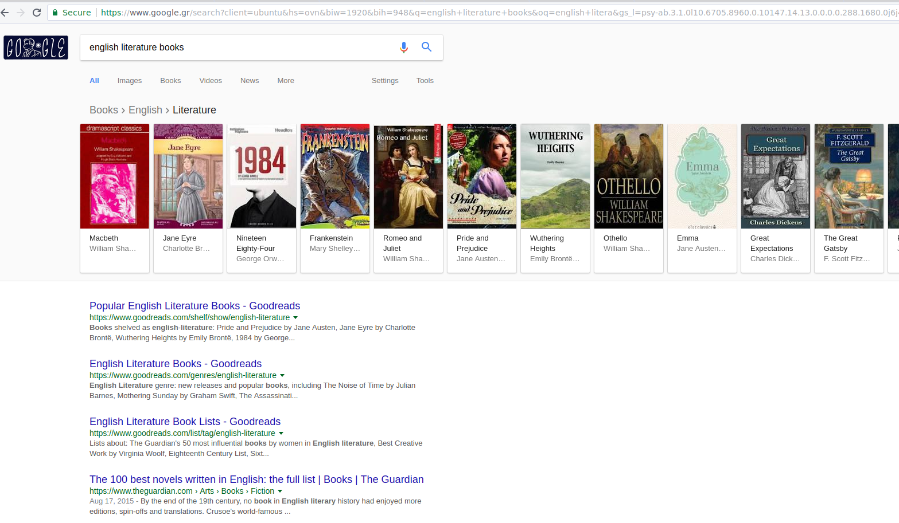
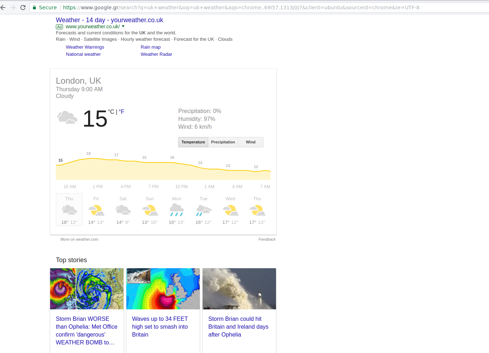
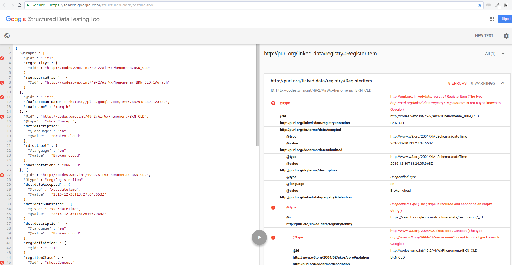

# WMO Metadata Considerations Concerning Google Search

## Google Search Features
In recent years Google has been very keen on categorizing web pages not through the textual content of the pages themselves, but rather by the use of **structured data** intended for that very purpose.  
As can be seen in their [About Search Features](https://developers.google.com/search/docs/guides/search-features) page, Google can provide certain exrta features if structured data is used to describe the web page.

Nevertheless, Google also explicitly states the following:
> There is no guarantee that your page will appear in Search results with the specified feature. This is because search features depend on many factors, including the search device type, location, and whether Google thinks the feature would provide the best search experience for the user.

The above - in short - means that there is no fail-safe way to achieve getting listed in their search results, but adhering to their concepts increases the chances of getting there.

## Introduction to Structured Data
It appears that JSON-LD is the favorite structured data flavor for Google. Their [Introduction to Structured Data](https://developers.google.com/search/docs/guides/intro-structured-data) page provides useful information on the general concept of using structured data.

The important points in this information are the following:
- JSON-LD is **recommended** by Google for structured data.
- Google provides a couple of tools to assist with structured data management, the _Structured Data Testing Tool_ and the _Search Console Structured Data Report_.
- Google can make general use of the _sameAs_ property and other _schema.org_ structured data. Some of these elements may be used to enable future Search features, if they are deemed useful.

> #### Important
>
> Google states that: _You must include all the required properties for an object to be eligible for appearance in Google Search with enhanced display._
> This practically means that the metadata specified using JSON-LD _should_ be validated before published, or Google will ignore them completely. Furthermore, as can be seen when using the _Structured Data Testing Tool_, threre are certain "recommeneded" attributes that - if present - will assist Google in categorizing the page more efficiently.

## Structured Data Guidelines
By "reverse-engineering" Google's **Important** note in [General Guidelines](https://developers.google.com/search/docs/guides/sd-policies) for structured data, we can infer some valuable information on how Google search works. Aparrently it:
- Somehow determines whether the main content of the page is relevant to the structured data.
- The content relevant to the structured data is visible to the user.
- Ensures that the [Webmaster Guidelines](https://support.google.com/webmasters/answer/35769) are adhered.

Furthermore, there is a hint that their search business logic does more validation than the _Structured Data Testing Tool_.  
Finally, a guard against [Common Errors](https://developers.google.com/search/docs/guides/prototype#common-sd-errors) regarding structured data is provided.

## Recommended Process
Apart from the general guidelines summarized above, the search giant provides a recommended process that - if followed - will greatly assist into producing the content it expects to find, thus providing improved search results. The complete process is described [here](https://developers.google.com/search/docs/guides/prototype).

### Content Type Considerations
Going through the process steps in detail, we discover that there are distinct guidelines for each page and feature type, as witnessed in their [Search Gallery](https://developers.google.com/search/docs/guides/search-gallery). For example, there is a specific JSON-LD structure to make Google display [breadcrumbs](https://developers.google.com/search/docs/data-types/breadcrumbs) for a large site, and a different one to display recipies in a [carousel](https://developers.google.com/search/docs/guides/mark-up-listings).

Furthermore, the content type defined in the structured data is important as to what Google will display as search results. 
To illustrate this, these are the search results for `english literature books`:

In this search, we can notice the following:
1. Google knows what books are and it has a special way of treating them. This can happen by using JSON-LD as we can see [here](https://developers.google.com/search/docs/data-types/books), or by using `<meta> tags`.
2. Google goes one step beyond plain categorization of books, and provides a breadcrumb of its own: `Books > English > Literature`.
3. By examining [The 100 best novels written in English: the full list | Books | The Guardian](https://www.theguardian.com/books/2015/aug/17/the-100-best-novels-written-in-english-the-full-list) search result page, we can find some JSON-LD content, but that only refers to the fact that The Guardian is an organization, and what we see is a web-page. Nevertheless, Google infers that this page is about books from `<meta> tags`, title, and content.

One more important thing to note is that Google doesn't know _everything_. If we search for `UK weather` we get the following results:

In this search we can notice that:
1. Google doesn't handle _weather_ as a separate entity, like it does with _books_. The weather forecast for London is an external service, and not a search result. This is also evident when examining [this list](https://developers.google.com/search/docs/guides/search-gallery#content-types) of content types. Weather is not in there. 
2. Nevertheless, Google will try to fetch relevant results from structured data. The [articles](https://developers.google.com/search/docs/data-types/articles) are always good candidates for that.
3. By examining the [Storm Brian WORSE than Ophelia: Met Office confirm 'dangerous' WEATHER BOMB to SMASH UK](http://www.express.co.uk/news/weather/867915/Storm-Brian-weather-bomb-UK-weather-warning-Met-Office-BBC-weather-path-latest-forecast) article search result page, we see that "UK weather" is not pard of the JSON-LD specified on the site, but it is again linked through `<meta> tags` and Google ads.

### Structured Data Validation
This step is essential, since Google states that invalid structured data will just not be indexed correctly, so they will not appear as search results.
To run a quick test, we loaded the [JSON-LD "with metadata"](http://codes.wmo.int/49-2/AirWxPhenomena/BKN_CLD?_format=jsonld&_view=with_metadata) for the "Broken Cloud" air phenomenon into Google's structured data test tool, and got the following:

As it is obvious, the JSON-LD did not pass validation. This doesn't mean that a page with this structured data will not be returned at all in the search results, but only that Googles "structured data engine" will ignore it. Still, it's prefferable to have a correct JSON-LD than to search for work-arounds.

### See Through Google's Eyes
Google provides a tool for webmasters, which is created in order to help them see what the search engine perceives from their page. This [Fetch as Google](https://www.google.com/webmasters/tools/googlebot-fetch) tool is invaluable when testing the correctness of structured data.

### After Going Live
The expected behaviour after going live is an icrease of cards of structured data types in the [Rich Cards Report](https://www.google.com/webmasters/tools/rich-cards), as well as no errors from the [Structured Data Report](https://www.google.com/webmasters/tools/structured-data). These tools should be used for periodic monitoring, and are highly recommended every time significant changes are performed.

## The Verdict
The above information illustrate that there is a quite complex procedude going on behind-the-scenes with Google search. The algorithm is - of course - kept secret, and the search engine representatives thmselves tell us that there is absolutely no guarantee that `you type this query --> you get that result`. Results can change on different computers of the same network, on different browsers of the same computer, even with different sessions of the same browser.

Nevertheless, what we can infer (with varying degrees of confidence) is the following:
- Google `likes it` when you use structured data because it allows it to categorize your page more efficiently.
- Google `prefers` the JSON-LD flavor of structured data.
- Google `does not know all` structured data types. It primarily uses some from _schema.org_, and it is believed that it pays more attention to specific entities that are more valuable commercially, such as [Music](https://developers.google.com/search/docs/data-types/music), [Products](https://developers.google.com/search/docs/data-types/products), [TV & Movies](https://developers.google.com/search/docs/data-types/tv-movies), etc.
- Google `merges different information` when it categorizes and ranks results. This means that structured data will be used in conjuction with other information, such as `<meta> tags`, or text content.
- Google `provides guidelines and best practices` which are not fool-proof, but are intended to assist with achieving the best possible search placement.